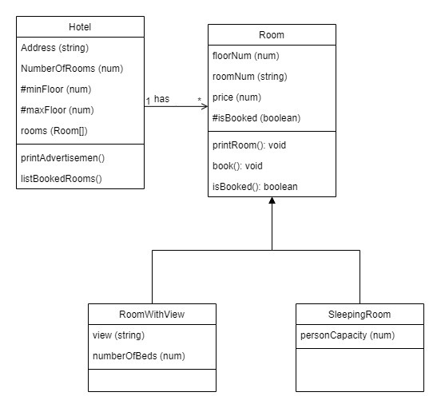

<h1>Gaza Sky Geeks Advanced JavaScript Training</h1>
<h2>Project1: Object Oriented based NodeJS/JavaScript Application </h2>

<h3>Problem Statement : </h3> 

No user input is required.
2) Use Mock data to fill in all scenarios.
3) Create one hotel with multiple rooms (different types of rooms).
4) Notice we have some private members of the classes.
5) Build the relation between classes correctly.
6) You might need to do some extra reading to implement some parts .

